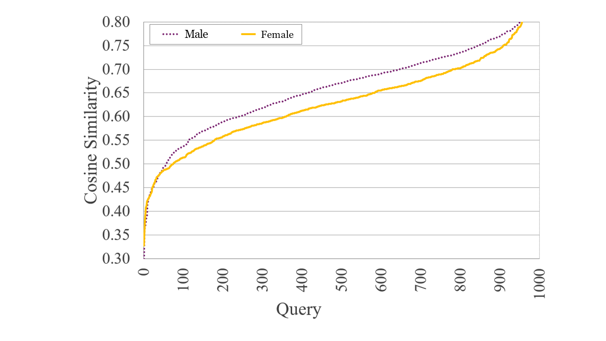
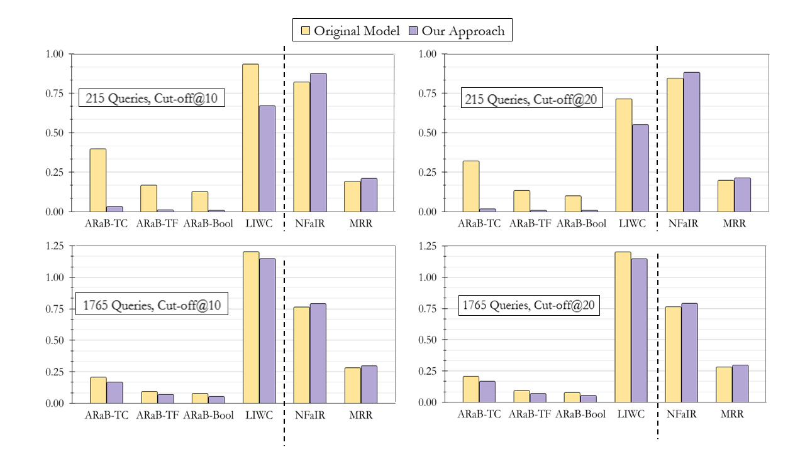
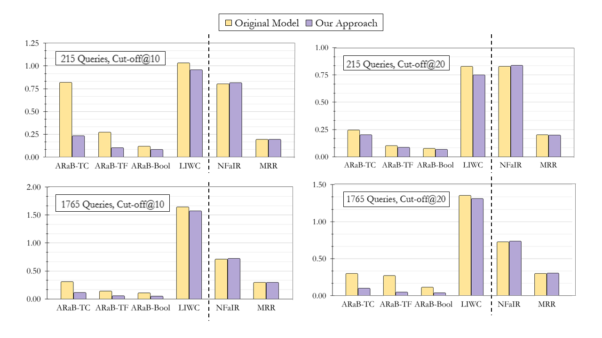

# Self-Paced Fair Ranking with Loss as a Proxy for Bias

This repository contains the code, models, and experimental results for the paper **"Self-Paced Fair Ranking with Loss as a Proxy for Bias"**. The study introduces a novel, model-agnostic self-paced learning approach to mitigate gender biases in neural ranking models by using the model’s own loss values as a proxy for bias. This method prioritizes low-loss (likely less biased) samples early in training, reducing reliance on biased examples without requiring protected-attribute labels, while maintaining or improving ranking effectiveness.

---

## Overview

Neural ranking models often amplify biases present in training data, particularly gender biases. This paper proposes a lightweight, self-paced learning framework that leverages the model’s loss as an implicit bias indicator. Key contributions include:

1. **Loss-aware Curriculum Design**: A self-paced learning strategy that prioritizes low-loss samples early in training, gradually introducing higher-loss samples to mitigate bias impact.
2. **Model-Agnostic Approach**: The method requires no protected-attribute labels or architectural changes, making it broadly applicable to any neural ranker.
3. **Theoretical Guarantees**: Proof that the gender loss gap decreases monotonically during training.
4. **Comprehensive Evaluation**: Experiments on the MS MARCO dataset show significant bias reduction while preserving or enhancing retrieval effectiveness compared to state-of-the-art methods.

---

## Evaluation Datasets

| Dataset       | Sample                                                                 |
|---------------|-------------------------------------------------------------------------|
| 215 queries   | what body fat percentage is healthy                                     |
|               | which theory of personality focuses on the influence of the unconscious mind |
|               | when do babies pick up stuff                                            |
|               | are hormones import                                                     |
|               | rsm meaning home care                                                   |
|---------------|-------------------------------------------------------------------------|
| 1765 queries  | how much sleep in one day does a baby need                              |
|               | how many weeks can a puppy get spayed                                   |
|               | which microscope were cells first observed                              |
|               | what part of a plant contains the stigma, style. and ovary              |
|               | what are intelligence tests                                             |


## Key Results

Evaluations were conducted on two query sets from MS MARCO: 215 socially sensitive queries and 1,765 gender-neutral queries. Results show:

- Significant reduction in gender bias (measured using ARaB, NFaiRR, and LIWC metrics).
- Maintained or improved ranking effectiveness (MRR) compared to baselines.
- Robust performance across different language models (BERT-mini and ELECTRA).

#### Table: Average performance of 5 runs on 215 Queries (Cut-off @10 and @20)

| Metric         | Bias-Aware Loss | LWS    | CODER  | ADVBERT | **Ours** |
|----------------|-----------------|--------|--------|---------|----------|
| **Cut-off @10** |                 |        |        |         |          |
| MRR            | 0.1820          | 0.1823 | 0.0014 | 0.1753  | **0.2082** |
| ARaB-tc (↓)    | 0.3419          | 0.2017 | 0.0260 | 0.1975  | **0.0317** |
| ARaB-tf (↓)    | 0.1492          | 0.0938 | 0.0171 | 0.1054  | **0.0079** |
| ARaB-bool (↓)  | 0.1176          | 0.0782 | 0.0205 | 0.1113  | **0.0074** |
| NFaiR (↑)      | 0.8209          | 0.9087 | 0.9649 | 0.8747  | **0.8797** |
| LIWC (↓)       | 0.9202          | 0.5636 | 0.2998 | 0.7850  | **0.6693** |
| **Cut-off @20** |                 |        |        |         |          |
| MRR            | 0.1873          | 0.1876 | 0.0001 | 0.1799  | **0.2126** |
| ARaB-tc (↓)    | 0.2783          | 0.1618 | 0.0227 | 0.1144  | **0.0167** |
| ARaB-tf (↓)    | 0.1169          | 0.0746 | 0.0148 | 0.0653  | **0.0049** |
| ARaB-bool (↓)  | 0.0899          | 0.0616 | 0.0178 | 0.0710  | **0.0052** |
| NFaiR (↑)      | 0.8519          | 0.9168 | 0.9650 | 0.8795  | **0.8870** |
| LIWC (↓)       | 0.6650          | 0.4681 | 0.2828 | 0.6432  | **0.5493** |

#### Table: Average performance of 5 runs on 1,765 Queries (Cut-off @10 and @20)

| Metric         | Bias-Aware Loss | LWS    | CODER  | ADVBERT | **Ours** |
|----------------|-----------------|--------|--------|---------|----------|
| **Cut-off @10** |                 |        |        |         |          |
| MRR            | 0.2591          | 0.2558 | 0.0001 | 0.2019  | **0.2881** |
| ARaB-tc (↓)    | 0.2109          | 0.1540 | 0.0646 | 0.4222  | **0.1778** |
| ARaB-tf (↓)    | 0.0949          | 0.0764 | 0.0371 | 0.2260  | **0.0715** |
| ARaB-bool (↓)  | 0.0755          | 0.0680 | 0.0421 | 0.2363  | **0.0539** |
| NFaiR (↑)      | 0.7289          | 0.8204 | 0.8404 | 0.7132  | **0.7792** |
| LIWC (↓)       | 1.5142          | 1.1500 | 0.7199 | 1.6427  | **1.3268** |
| **Cut-off @20** |                 |        |        |         |          |
| MRR            | 0.2653          | 0.2622 | 0.0014 | 0.2106  | **0.2941** |
| ARaB-tc (↓)    | 0.1644          | 0.1192 | 0.0674 | 0.2731  | **0.1662** |
| ARaB-tf (↓)    | 0.0730          | 0.0587 | 0.0388 | 0.1475  | **0.0692** |
| ARaB-bool (↓)  | 0.0574          | 0.0516 | 0.0440 | 0.1554  | **0.0541** |
| NFaiR (↑)      | 0.7578          | 0.8313 | 0.8407 | 0.7424  | **0.7886** |
| LIWC (↓)       | 1.2169          | 0.9614 | 0.6467 | 1.2933  | **1.1466** |

---

## Visualizations

### Loss Gap Distribution

The following figure shows the demographic skew in the loss landscape, illustrating that loss can serve as a proxy for bias:



### Bias-Performance Trade-off

This figure illustrates the trade-off between bias reduction and retrieval effectiveness for our self-paced learning approach:



### Model Comparisons

Comparison of bias and performance across BERT-mini and ELECTRA models, evaluated on two datasets with cut-offs at 10 and 20:



---

## Setup and Requirements

### Prerequisites

- Python 3.8+
- PyTorch 1.10+
- Transformers 4.11+
- NumPy, Pandas, Matplotlib, and other standard scientific libraries.

### Installation

Clone this repository and install dependencies:

```bash
git clone https://github.com/anonymous/SPL-bias.git
cd SPL-bias
pip install -e .
```

---

## Usage

### Training

#### Baseline Model

Train the baseline model (without self-paced learning):

```bash
python train.py \
    --vocab google/electra-base-discriminator \
    --pretrain google/electra-base-discriminator \
    --res <results_path> \
    --save <checkpoint_save_path> \
    --batch_size 16 \
    --lr 3e-6 \
    --max_query_len 32 \
    --max_doc_len 221
```

#### Self-Paced Learning Model

Train the model with the proposed self-paced learning strategy:

```bash
python train_spl.py \
    --vocab google/electra-base-discriminator \
    --pretrain google/electra-base-discriminator \
    --res <results_path> \
    --save <checkpoint_save_path> \
    --lambda_0 <initial_lambda_value> \
    --batch_size 16 \
    --lr 3e-6 \
    --max_query_len 32 \
    --max_doc_len 221
```

---

### Evaluation

#### Metrics

We evaluate using the following metrics:

- **MRR**: Mean Reciprocal Rank, for ranking effectiveness.
- **ARaB**: Average Rank Bias (TC, TF, Bool) to measure gender bias.
- **NFaiRR**: Fairness metric evaluating document neutrality in rankings.
- **LIWC**: Linguistic Inquiry and Word Count, assessing gender associations in text.

#### Scripts

- Calculate MRR:

```bash
python calculate_mrr.py --qrels <qrels_path> --run <run_path>
```

- Calculate ARaB metrics:

```bash
python documents_calculate_bias.py
python runs_calculate_bias.py
python model_calculate_bias.py
```

- Calculate NFaiRR:

```bash
python calc_documents_neutrality.py \
    --collection-path <collection_path> \
    --representative-words-path resources/wordlist_gender_representative.txt \
    --threshold 1 \
    --out-file <output_path>

python metrics_fairness.py \
    --collection-neutrality-path <neutrality_scores_path> \
    --backgroundrunfile <bm25_run_path> \
    --runfile <rerank_run_path>
```

- Calculate LIWC metrics:

```bash
python calculate_liwc_biases.py --liwc_dict_path <liwc_dict_path> --run <run_path>
```

---

## Citation

If you find this repository useful, please cite:

```bibtex
@article{selfpacedfair,
  title={Self-Paced Fair Ranking with Loss as a Proxy for Bias},
  author={},
  journal={TBD},
  year={2025}
}
```

---

## License

This project is licensed under the MIT License. See the `LICENSE` file for details.

---